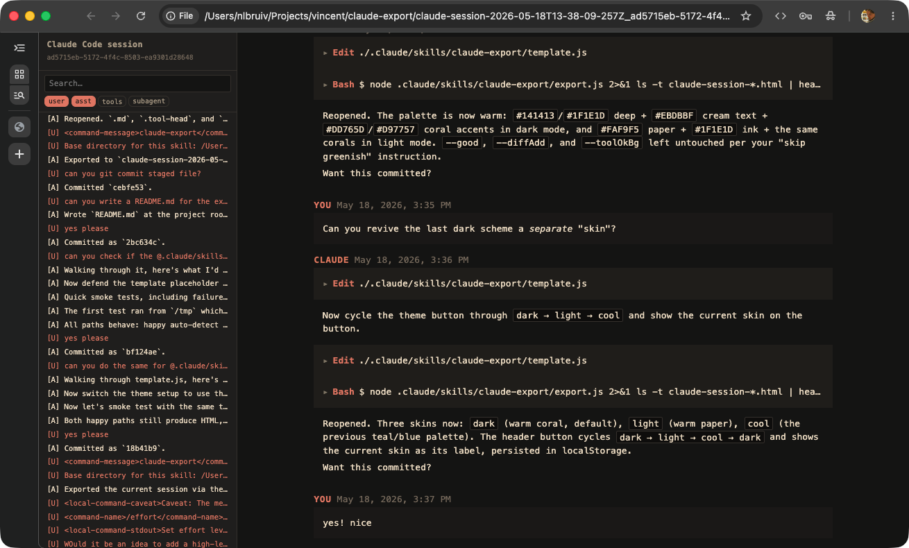
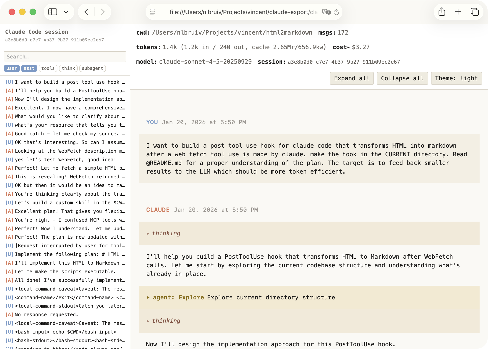

# session-export

A skill that converts a coding-agent session transcript into a single
self-contained HTML file — user/assistant turns, thinking/reasoning, every
tool call with its result, and any subagent transcripts rendered inline.

Works with two CLIs, each reading the local `.jsonl` transcripts that CLI
writes:

- **Claude Code** — `export.js`, reading `~/.claude/projects/<encoded-cwd>/`.
- **OpenAI Codex** — `codex-export.js`, reading `~/.codex/sessions/…`.

Both run offline against on-disk session files; the desktop/web/IDE clients of
either tool don't produce these files.





It ships both as a **Claude Code plugin/skill** (`.claude-plugin/`) and an
**OpenAI Codex plugin/skill** (`.codex-plugin/`), with the skill itself in
`skills/session-export/`.

## Install

**Claude Code** — copy the skill into a project, or symlink it user-globally:

```sh
cp -R skills/session-export /path/to/other-project/.claude/skills/
# or
ln -s "$PWD/skills/session-export" ~/.claude/skills/session-export
```

**OpenAI Codex** — the repo is a Codex plugin (`.codex-plugin/plugin.json`).
Add it to a Codex marketplace and install, or point Codex at this repo as a
local plugin source. The bundled `session-export` skill is then available in
Codex sessions.

## Use

In Claude Code, run `/session-export`, or call the matching exporter directly:

```sh
# Claude Code session
node skills/session-export/export.js [session-id-or-path] [--no-redact]
# OpenAI Codex session
node skills/session-export/codex-export.js [session-id-or-path] [--no-redact]
```

- **no argument** — most recently modified session for the current context
- **session id** — looked up in the CLI's session store
- **path** — used directly
- **`--no-redact`** — skip the credential-redaction pass

The HTML is written to `claude-session-…` / `codex-session-…_<sessionId>.html`
in the current directory and its absolute path printed to stdout.

## Secret redaction

By default every message, thinking block, tool input, and tool result
is scanned for well-known credential shapes (Anthropic / OpenAI / Stripe
keys, AWS access keys, GitHub PATs, Slack tokens, Google API keys, JWTs,
`-----BEGIN … PRIVATE KEY-----` blocks) and matches are replaced with
`[REDACTED:<kind>]`. Counts appear as a yellow `redacted:<n>` chip in the
header. It's a heuristic pass — review exports before sharing.

## What's in the HTML

- Embedded JSON payload in `<script id="session-data">` (no base64).
- Inline CSS, no CDN. Searchable sidebar tree with filter chips
  (user / asst / tools / subagent); resizable, collapsible.
- Collapsible thinking blocks and tool outputs; subagent
  (`Task` / `Agent` / `Explore` / …) cards expand to the full nested
  transcript, recursively.
- Keyboard: `/` focus search · `t` thinking · `o` tool outputs ·
  `b` sidebar · `[` / `]` prev/next turn · `Esc` clear search.

## Themes

Ships `dark` (default) and `light`, respects `prefers-color-scheme`, and
the toggle is persisted in `localStorage`. Add more by dropping a
`themes.css` next to `template.js`: each `:root[data-theme="<name>"]`
block it defines is appended to the export and added to the toggle
cycle — omitted variables inherit from `dark`. The shipped `themes.css`
includes a `cool` example.

## Subagent storage formats

Claude Code has shipped three transcript layouts; the exporter handles
all three: per-session `<sessionId>/subagents/agent-<id>.jsonl` (+
`.meta.json`); `agent-<id>.jsonl` siblings linked by `sessionId`; and
inline `progress` records linked by `parentToolUseID` (deduped by inner
`uuid`). External tool-result spillover under
`<sessionId>/tool-results/<id>.txt` is inlined when present.

## Files

```
.claude-plugin/plugin.json   — Claude Code plugin manifest (+ marketplace.json)
.codex-plugin/plugin.json    — OpenAI Codex plugin manifest
.agents/plugins/marketplace.json — Codex marketplace entry
skills/session-export/
  SKILL.md       — skill manifest (used by both CLIs)
  export.js      — Claude Code session resolver + payload builder
  codex-export.js — OpenAI Codex rollout resolver + payload builder
  redact.js      — shared secret-redaction pass
  template.js    — inline CSS + scaffold + client renderer (shared)
  themes.css     — optional extra themes (cool example)
```

No runtime dependencies; Node 18+.

## License

Open source under the [MIT license](./LICENSE). No tracking. No analytics.

## Author

[Vincent Bruijn](https://www.vincentbruijn.nl)
